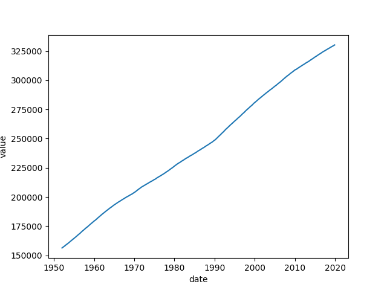
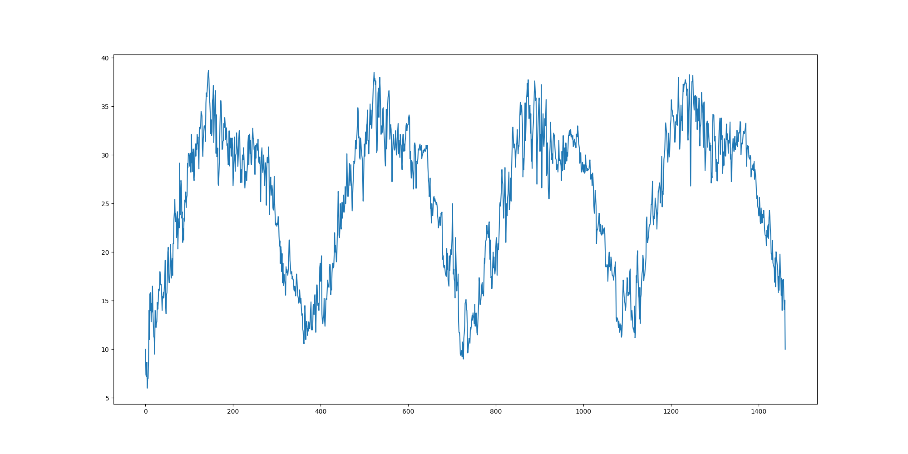

# ARIMA Forecasting and Pyro Models

## Table of contents

- [ARIMA Forecasting and Pyro Models](#arima-forecasting-and-pyro-models)
  - [Table of contents](#table-of-contents)
  - [Problem Statement](#problem-statement)
  - [Software Architecture](#software-architecture)
    - [Software Architecture Details](#software-architecture-details)
    - [Graphs for easier understanding and visualization](#graphs-for-easier-understanding-and-visualization)
  - [POPL Aspects](#popl-aspects)
    - [Probabilistic Programming (Pyro)](#probabilistic-programming-pyro)
    - [Data Visualization](#data-visualization)
    - [Backtesting Methodologies](#backtesting-methodologies)
    - [Modularity](#modularity)
    - [Data handling and abstraction](#data-handling-and-abstraction)
    - [Readability](#readability)
  - [Results and Tests](#results-and-tests)
    - [Standard linear regression](#standard-linear-regression)
    - [ARIMA](#arima)
    - [Pyro](#pyro)
      - [Pyro model 1 - A standard model without any periodic features](#pyro-model-1---a-standard-model-without-any-periodic-features)
      - [Pyro model2 - A model with periodic features](#pyro-model2---a-model-with-periodic-features)
      - [Pyro model 3](#pyro-model-3)
      - [Evaluating model performance using backtesting](#evaluating-model-performance-using-backtesting)
  - [Potential for Future Work](#potential-for-future-work)
  - [Experience and Difficulties](#experience-and-difficulties)

## Problem Statement

The project focuses on time series forecasting for gasoline prices, employing a comprehensive approach through ARIMA (AutoRegressive Integrated Moving Average) modeling, standard linear regression, and Pyro-based probabilistic forecasting. The primary aim is to capture seasonality patterns inherent in the data, offering insights into the temporal fluctuations of gasoline prices. The code uniquely addresses the intricate challenge of time series forecasting for gasoline prices, standing out by incorporating a probabilistic programming approach through Pyro. Beyond seasonality patterns, the goal is to provide a nuanced understanding of uncertainty in predictions. Probabilistic programming, a key aspect of POPL, enhances the forecasting models, making them more adaptable to real-world uncertainties compared to traditional methods. Additionally, backtesting methodologies are employed to assess model performance. Challenges involve fine-tuning model parameters, mastering probabilistic programming concepts, and addressing the complexities of backtesting in the context of time series forecasting. The project serves as a practical exploration of diverse forecasting methodologies, laying the groundwork for further enhancements and applications in the realm of time series analysis. This has been done by comparing time-series forecasting results obtained from Pyro, against conventional Python models like ARIMA and focusing on the edge that Pyro provides for such problem statements. We explicitly compare various models written in Pyro against simple linear regression and even more well-suited ARIMA models to tackle the problem and display how Pyro fares against them in various parameters leveraging the probabilistic programming principles.

## Software Architecture

The code is written in Python and utilizes Jupyter notebooks. The main components include:

- **ARIMA Forecasting:** Utilizes the `statsmodels` library to implement an ARIMA model for time series forecasting.
- **Standard Linear Regression:** Uses the `scikit-learn` library to implement a linear regression model as a baseline.
- **Pyro Forecasting Models:** Implements forecasting models using Pyro, a probabilistic programming library.

### Software Architecture Details

The integration of Pyro is highlighted in the architecture, emphasizing how probabilistic programming augments the forecasting models. The flexibility of Pyro is showcased, aligning with the principle of modularity. Python's data science libraries, coupled with Pyro, foster a comprehensive approach to capturing uncertainty in the gasoline price forecasting process. We leverage the collaborative environment provided by various IPython Notebook handlers like Jupyter Notebooks and Google Collab to integrate our contributions. Key components include data preprocessing, exploratory data analysis, and the implementation of time series forecasting models. The code is modular, with dedicated sections for data visualization, linear regression, ARIMA modeling, and Pyro-based forecasting. The input dataset, "gasoline.csv," promotes simplicity and ease of reproducibility. The architecture, balancing accessibility and functionality, is well-suited for educational purposes and exploratory analysis.

### Graphs for easier understanding and visualization

We've used 3 distinct datasets, all of which are described below:

The `arima_linear.ipynb` file contains a comparison between standard linear regression and ARIMA for linearly increasing data with no periodicity.
The dataset used is the `tests/population/POP.csv` file which contains the data for the population of the US from 1960 to 2019.

{width=500}

----

The file `pyro_seasonal.ipynb` contains a comparison between Pyro models and linear regression for data with constant periodicity and no linear trend.
The dataset used is the `tests/climate/DailyDelhiClimateTrain.csv` file which contains the data for daily temperatures in Delhi from 2013 to 2017.

{height=250}

----

The main file `arima.ipynb` contains a comparison between ARIMA, Pyro models and linear regression for data with periodicity.
The dataset used is the `tests/gasoline.csv` file which contains the data for weekly gasoline prices in the US from 1990 to 2019.

{height=260}

## POPL Aspects

### Probabilistic Programming (Pyro)

The integration of Pyro introduces a probabilistic approach to forecasting, capturing uncertainty in predictions through Bayesian modeling.
Pyro's `ForecastingModel` class is used to implement the forecasting models, aligning with the probabilistic programming principles.

```python
class BaseModel(ForecastingModel):
    def model(self, zero_data, covariates):
        data_dim = zero_data.size(-1)
        feature_dim = covariates.size(-1)
        bias = pyro.sample("bias", dist.Normal(0, 10).expand([data_dim]).to_event(1))
        weight = pyro.sample("weight", dist.Normal(0, 0.1).expand([feature_dim]).to_event(1))
        prediction = bias + (weight * covariates).sum(-1, keepdim=True)
        assert prediction.shape[-2:] == zero_data.shape

        noise_scale = pyro.sample("noise_scale", dist.LogNormal(-5, 5).expand([1]).to_event(1))
        noise_dist = dist.Normal(0, noise_scale)

        self.predict(noise_dist, prediction)
```

Time Series Analysis (ARIMA): The ARIMA model is employed to analyze and forecast time-dependent patterns, considering autocorrelation and seasonality in the data.
`statsmodels` is used to implement the ARIMA model, aligning with the time series analysis principles.

```python
from statsmodels.tsa.arima.model import ARIMA
model = ARIMA(df.value, order=(1,1,2))
model_fit = model.fit()
```

Post fittng the model, we can then analyse the model's summary

```text

                               SARIMAX Results                                
==============================================================================
Dep. Variable:                  value   No. Observations:                  816
Model:                 ARIMA(1, 1, 2)   Log Likelihood               -3760.407
Date:                Wed, 22 Nov 2023   AIC                           7528.814
Time:                        23:46:40   BIC                           7547.627
Sample:                             0   HQIC                          7536.035
                                - 816                                         
Covariance Type:                  opg                                         
==============================================================================
                 coef    std err          z      P>|z|      [0.025      0.975]
------------------------------------------------------------------------------
ar.L1          0.9973      0.001   1788.055      0.000       0.996       0.998
ma.L1         -0.3955      0.015    -25.526      0.000      -0.426      -0.365
ma.L2         -0.4524      0.021    -21.830      0.000      -0.493      -0.412
sigma2       558.6078     11.629     48.035      0.000     535.815     581.401
===================================================================================
Ljung-Box (L1) (Q):                  41.56   Jarque-Bera (JB):              3856.09
Prob(Q):                              0.00   Prob(JB):                         0.00
Heteroskedasticity (H):               1.03   Skew:                            -0.65
Prob(H) (two-sided):                  0.83   Kurtosis:                        13.58
===================================================================================
```

### Data Visualization

`Matplotlib` and the `Pandas.Dataframe.plot()` methods is are for data visualization, aligning with the importance of conveying insights through clear and informative plots.
All the plots are saved in the `results` folder.

### Backtesting Methodologies

The inclusion of backtesting techniques addresses the need for robust model evaluation, ensuring predictive capabilities extend beyond training data.
Using the `backtest` function from the `pyro.contrib.forecast` module, the code implements backtesting for Pyro models.

```python
from pyro.contrib.forecast import ForecastingModel, Forecaster, backtest, eval_crps

pyro.set_rng_seed(1)
pyro.clear_param_store()
windows1 = backtest(data, covariates, Model1,
                    min_train_window=62, test_window=100, stride=50,
                    forecaster_options={"learning_rate": 0.1, "time_reparam": "dct",
                                        "log_every": 1000, "warm_start": True})
```

### Modularity

The modular design of the code, as seen in the distinct sections for linear regression, ARIMA modeling, and Pyro-based forecasting, reflects a principle of modularity, promoting code organization and reusability.
We've reused a lot of code because of the modular design of the code, which has helped us in making the code more readable and maintainable.

### Data handling and abstraction

```python
path = "../tests/climate/DailyDelhiClimateTrain.csv"
df = pd.read_csv(path)
df.head()
df['date'] = pd.to_datetime(df['date'])
data = torch.tensor(df['meantemp'].values, dtype=torch.float)
# normalize data
data = (data - data.mean())/data.std()
data.unsqueeze_(-1) 
```

The project also involves abstracting and manipulating data, which makes it easier to create models or structures that capture the key aspects of data, making it more manageable and easier to work with, and also adheres to principles of data abstraction common in programming languages.

### Readability

The use of clear variable names, comments, and structured code contributes to readability, a fundamental principle in programming languages design.
We've used comments and clear variable names wherever possible to make the code more readable and understandable.

## Results and Tests

The code includes visualization of the data, predictions, and evaluation metrics for different models. The ARIMA model, linear regression, and Pyro-based models are compared using CRPS, MAE, and RMSE metrics. Visualizations include time series plots and forecast comparisons.

### Standard linear regression

{height=350}

zooming in on the predict vs test section highlighted in orange

{height=350}

As we can see, the linear regression model is not able to capture the periodicity in the data and hence is not able to predict the values accurately.

### ARIMA

Residuals refer to the differences between the observed values and the values predicted by the ARIMA model. These differences are also known as errors or residuals.

We plot the residuals to check if the model has captured the information correctly. If the model has captured the information correctly, the residuals should be random and should not follow any pattern.

{height=350}

If the model is accurate, the density plot of the residuals should be a normal distribution centered at zero.
Density plot of residuals

{height=350}

Autocorrelation of residuals is a diagnostic measure used in time series analysis to assess whether there are any patterns or trends left in the residuals of a model. Residuals are the differences between the observed values and the values predicted by a statistical model.

Autocorrelation is a measure of the correlation between a variable and a lagged version of itself. In the context of residuals, autocorrelation assesses whether the residuals at one time point are correlated with the residuals at a previous time point. If autocorrelation is present, it suggests that the model has not fully captured the temporal dependencies in the data.

Autocorrelation plot of residuals
{height=350}

Some more statistics using rolling forecasting ARIMA model
{height=350}

Plotting ARIMA forecast vs actual values
{height=350}

### Pyro

#### Pyro model 1 - A standard model without any periodic features

The weights and biases are sampled from normal distributions with mean 0

```python
bias = pyro.sample("bias", dist.Normal(0, 10).expand([data_dim]).to_event(1))
weight = pyro.sample("weight", dist.Normal(0, 0.1).expand([feature_dim]).to_event(1))
```

{height=350}

Pyro model 1 close up
{height=350}

#### Pyro model2 - A model with periodic features

Covariates with a periodic feature of `52` are added to the model to capture the periodicity in the data, as the data has a periodicity of 52 weeks.

```python
time = torch.arange(float(end)) / 365
covariates = torch.cat([time.unsqueeze(-1),
                        periodic_features(end, 52)], dim=-1)
```

{height=350}

Zooming in on the predict vs test portion
{height=350}

#### Pyro model 3

The model is similar to the previous model, with an added `drift` feature to capture the linear trend in the data.

```python
drift_scale = pyro.sample("drift_scale",
                            dist.LogNormal(-20, 5).expand([1]).to_event(1))
with self.time_plate:
    # We'll use a reparameterizer to improve variational fit
    with poutine.reparam(config={"drift": LocScaleReparam()}):
        drift = pyro.sample("drift", dist.Normal(zero_data, drift_scale).to_event(1))
```

{height=350}

Pyro model 3 close-up
{height=350}

#### Evaluating model performance using backtesting

An increasing window backtesting strategy is used to evaluate model performance, with the `backtest` function from the `pyro.contrib.forecast` module.

```python
windows1 = backtest(data, covariates, Model1,
                min_train_window=62, test_window=100, stride=50,
                forecaster_options={"learning_rate": 0.1, "time_reparam": "dct",
                                    "log_every": 1000, "warm_start": True})
```

```text
INFO   Training on window [0:62], testing on window [62:162]
INFO   step    0 loss = 6.59805e+10
INFO   step 1000 loss = 0.489358
INFO   Training on window [0:112], testing on window [112:212]
INFO   step    0 loss = 0.413746
INFO   step 1000 loss = -0.115989
INFO   Training on window [0:162], testing on window [162:262]
INFO   step    0 loss = 0.368944
INFO   step 1000 loss = -0.346092
INFO   Training on window [0:212], testing on window [212:312]
INFO   step    0 loss = 0.314416
INFO   step 1000 loss = -0.373688
INFO   Training on window [0:262], testing on window [262:362]
INFO   step    0 loss = 0.167238
....

```

{width=695}

## Potential for Future Work

Given more time, potential areas for improvement and expansion include:

- **Hyperparameter Tuning:** Fine-tune hyperparameters for ARIMA and Pyro models to enhance performance.
- **Ensemble Methods:** Explore ensemble methods to combine predictions from multiple models for better forecasting accuracy.
- **Feature Engineering:** Experiment with additional features or transformations to improve model understanding and predictive power.
- **Dynamic Model Updating:** Implement dynamic model updating to adapt models to changing patterns in the data.
- **Further work on the other mentioned databases** Implement and more accurately plot results for arima vs linear regression and linear regression vs pyro models in other datasets.
  
## Experience and Difficulties

- **Finding the right dataset:** Finding the right dataset for the problem statement was a challenge as we had to find a dataset that had a periodicity of 52 weeks and also had a linear trend to properly compare the models.
- **ARIMA Complexity:** ARIMA models require careful selection of parameters, and tuning them for optimal performance can be challenging.
- **Probabilistic Programming:** Working with Pyro involves understanding complex probabilistic concepts, which may pose a learning curve.
- **Backtesting Challenges:** Designing effective backtesting strategies and interpreting results can be complex in time series forecasting.
